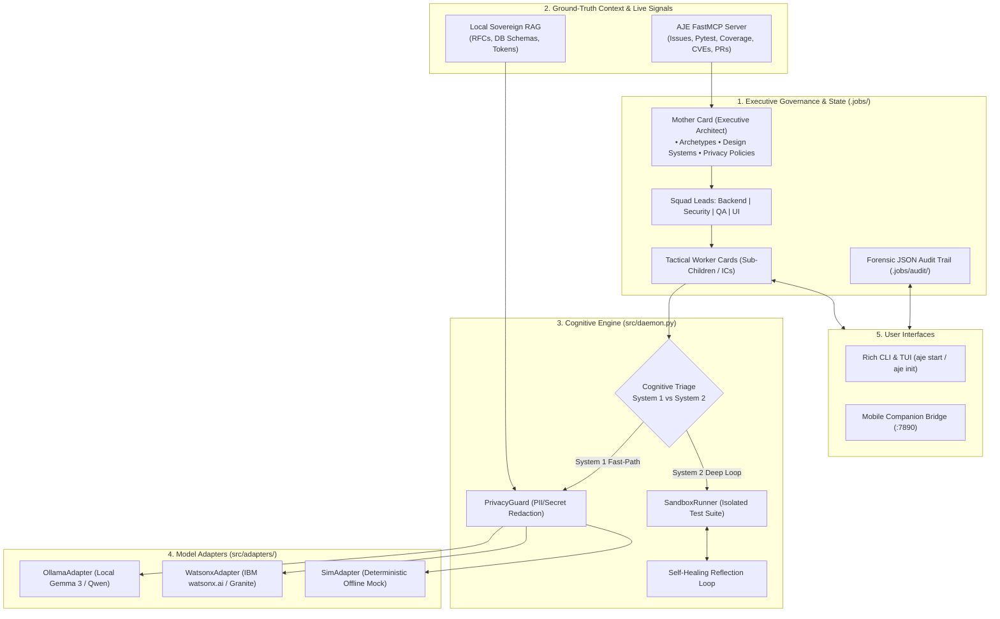

# 👩‍👦 Autonomous Job-Card Engine (AJE) v2.0

[](https://opensource.org/licenses/Apache-2.0)
[](https://www.python.org/)
[](#)
[](mcp-server/)
[](#)

> **Say goodbye to active chat prompting.** Define goals declaratively, let the multi-tiered Mother-Child engine orchestrate execution safely, and watch your entire engineering fleet autonomously self-improve, test, and expand 24/7.

---

## 💡 What is AJE?

Most AI coding agents act as single, reactive pair-programmers requiring continuous chat prompts, copy-pasting error traces, and constant manual direction. 

The **Autonomous Job-Card Engine (AJE)** is a declarative **operating system for an entire autonomous software engineering department**:

1. **3-Tier Organizational Hierarchy**: A long-lived **Mother Card** (VP of Engineering / Staff Architect) orchestrates **Department Squad Leads** (Backend, Security, QA, UI), which supervise ephemeral **Tactical Worker Cards** (Junior/Mid/Senior ICs).
2. **Dual-Process Cognitive Triage**: 
   * **⚡ System 1 (Heuristic Fast-Path)**: Instant, single-pass generation for documentation, typos, and formatting—bypassing sandbox overhead.
   * **🧠 System 2 (Deliberative Self-Healing Loop)**: Executes multi-iteration code generation, sandboxed test verification, error reflection, and automated healing until all tests pass.
3. **Air-Gapped Local RAG Subsystem**: Embeds internal RFCs, architecture guidelines, database schemas, and design system tokens with sub-20ms local vector retrieval.
4. **Live Repository Intelligence (FastMCP Server)**: Continuously inspects open GitHub issues, failing tests, test coverage, outdated dependencies, `pip-audit` CVEs, TODO comments, and PR reviews to discover what to build next.
5. **Hybrid Sovereign Privacy Guard**: Sensitive credentials and restricted paths automatically force local model execution (e.g. Gemma 3 / Qwen 2.5 via Ollama) and redact secrets before cloud routing.
6. **Mobile Companion & Remote Bridge**: Real-time HTTP/JSON sync with mobile devices for on-the-go notifications, diff reviews, and one-touch swipe-to-approve/dismiss.

---

## 🏗️ System Architecture



---

## 📦 Pre-Populated Mother Card Archetypes

AJE comes with production-ready, pre-configured Mother Card templates located in [`docs/mother-cards/`](docs/mother-cards/):

| Template | Focus | Squad Leads | Default Design System |
|---|---|---|---|
| **[`saas-backend.yaml`](docs/mother-cards/saas-backend.yaml)** | FastAPI, REST/OpenAPI, Redis rate limiting, SQLAlchemy, robust auth | Backend, Security, QA, DevOps | IBM Carbon Design System |
| **[`enterprise-security.yaml`](docs/mother-cards/enterprise-security.yaml)** | SOC2 compliance, CVE remediation, air-gapped local model routing | Security, Audit, QA | Air-Gapped / Strict |
| **[`opensource-maintainer.yaml`](docs/mother-cards/opensource-maintainer.yaml)** | Public GitHub triage, PR review feedback, SemVer 2.0, CHANGELOG sync | Issue Triage, Release Eng, Docs | Google Material Design 3 |
| **[`frontend-design.yaml`](docs/mother-cards/frontend-design.yaml)** | React/Next.js, Tailwind, WCAG 2.1 AA accessibility, component tokens | UI, Component Builder, QA | IBM Carbon Design System |

---

## 🛠️ Installation & Setup

### Prerequisites
* Python 3.11+
* (Optional) [Ollama](https://ollama.com) for local offline LLMs (`ollama pull gemma3:latest` or `qwen2.5-coder`)
* (Optional) IBM watsonx.ai credentials for cloud enterprise models

### 1. Clone & Install
```bash
git clone https://github.com/your-username/autonomous-job-card-engine.git
cd autonomous-job-card-engine

# Install dependencies and MCP server in editable mode
pip install -r requirements.txt
pip install -e mcp-server/
```

### 2. Run the Interactive Setup Wizard
Initialize your project, link your repository, and choose a Mother Card archetype:
```bash
python -m src.cli.main init
```

---

## 🖥️ CLI Commands & Usage

```bash
# Boot the autonomous engine cycle with live terminal dashboard
python -m src.cli.main start

# Check Mother health, active squad, and pending backlog queue
python -m src.cli.main status

# Manually inject an ad-hoc feature request or bug ticket
python -m src.cli.main inject \
  --name "Add Redis Rate Limiting" \
  --squad backend \
  --objective "Implement token bucket rate limiter in app/middleware/rate_limit.py" \
  --deliverables "app/middleware/rate_limit.py,tests/test_rate_limit.py" \
  --test "pytest tests/test_rate_limit.py"
```

---

## 📱 Mobile Companion Bridge

AJE includes a lightweight HTTP/JSON bridge that streams real-time `.jobs/` state to mobile devices or custom dashboards:

```python
from src.mobile_bridge import start_mobile_bridge

# Starts background API server on port 7890
server = start_mobile_bridge(workspace_root=".", port=7890)
server.serve_forever()
```

* **`GET /api/status`**: Returns real-time Mother health, active workers, and discovered backlog.
* **`GET /api/audit`**: Dumps forensic execution audit logs.
* **`POST /api/card/approve`**: One-touch approval for newly discovered successor cards.
* **`POST /api/card/inject`**: Remote task/bug injection from mobile companion.

---

## 🧪 Testing & Verification

Run the full end-to-end verification suite:

```bash
python test_aje_e2e.py
```

**Verified Capabilities:**
* ✔️ 3-Tier Hierarchy (`MotherCard`, `SquadLeadCard`, `ChildCard`)
* ✔️ Local RAG vector indexing and sub-20ms semantic query injection
* ✔️ System 1 fast-path lint execution
* ✔️ System 2 multi-iteration self-healing sandbox validation
* ✔️ Autonomous successor card discovery via gap analysis
* ✔️ Forensic JSON audit trails in `.jobs/audit/`

---

## 📓 Interactive Jupyter Demo

Experience the full autonomous lifecycle interactively inside the notebook:
* Open [`AJE_Interactive_Demo.ipynb`](AJE_Interactive_Demo.ipynb) in VS Code, Jupyter, or IBM Bob.

---

## 📜 License
Licensed under the Apache License, Version 2.0. See [LICENSE](LICENSE) for details.
