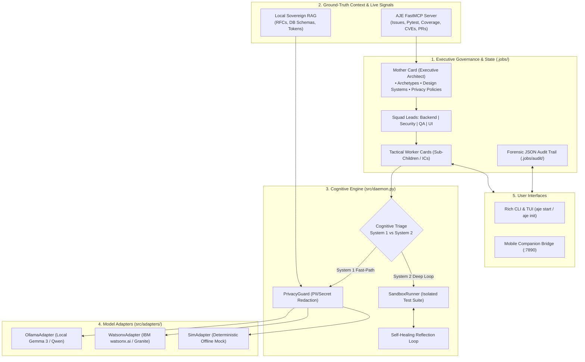
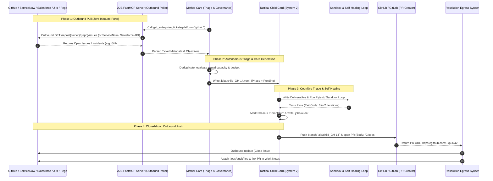

# 👩‍👦 Autonomous Job-Card Engine (AJE) v2.0

[](https://opensource.org/licenses/Apache-2.0)
[](https://www.python.org/)
[](#)
[](mcp-server/)
[](#)

> **Say goodbye to active chat prompting.** Define goals declaratively, let the multi-tiered Mother-Child engine orchestrate execution safely, and watch your entire engineering fleet autonomously self-improve, test, and expand 24/7.

---

## 💡 What is AJE?

Most AI coding agents act as single, reactive pair-programmers requiring continuous chat prompts, copy-pasting error traces, and constant manual direction. 

The **Autonomous Job-Card Engine (AJE)** is a declarative **operating system for an entire autonomous software engineering department**:

1. **3-Tier Organizational Hierarchy**: A long-lived **Mother Card** (VP of Engineering / Staff Architect) orchestrates **Department Squad Leads** (Backend, Security, QA, UI), which supervise ephemeral **Tactical Worker Cards** (Junior/Mid/Senior ICs).
2. **Dual-Process Cognitive Triage**: 
   * **⚡ System 1 (Heuristic Fast-Path)**: Instant, single-pass generation for documentation, typos, and formatting—bypassing sandbox overhead.
   * **🧠 System 2 (Deliberative Self-Healing Loop)**: Executes multi-iteration code generation, sandboxed test verification, error reflection, and automated healing until all tests pass.
3. **Air-Gapped Local RAG Subsystem**: Embeds internal RFCs, architecture guidelines, database schemas, and design system tokens with sub-20ms local vector retrieval.
4. **Live Repository Intelligence (FastMCP Server)**: Continuously inspects open GitHub issues, failing tests, test coverage, outdated dependencies, `pip-audit` CVEs, TODO comments, and PR reviews to discover what to build next.
5. **Hybrid Sovereign Privacy Guard**: Sensitive credentials and restricted paths automatically force local model execution (e.g. Gemma 3 / Qwen 2.5 via Ollama) and redact secrets before cloud routing.
6. **Mobile Companion & Remote Bridge**: Real-time HTTP/JSON sync with mobile devices for on-the-go notifications, diff reviews, and one-touch swipe-to-approve/dismiss.

---

## 🏗️ System Architecture



---

## 📦 Pre-Populated Mother Card Archetypes

AJE comes with production-ready, pre-configured Mother Card templates located in [`docs/mother-cards/`](docs/mother-cards/):

| Template | Focus | Squad Leads | Default Design System |
|---|---|---|---|
| **[`saas-backend.yaml`](docs/mother-cards/saas-backend.yaml)** | FastAPI, REST/OpenAPI, Redis rate limiting, SQLAlchemy, robust auth | Backend, Security, QA, DevOps | IBM Carbon Design System |
| **[`enterprise-security.yaml`](docs/mother-cards/enterprise-security.yaml)** | SOC2 compliance, CVE remediation, air-gapped local model routing | Security, Audit, QA | Air-Gapped / Strict |
| **[`opensource-maintainer.yaml`](docs/mother-cards/opensource-maintainer.yaml)** | Public GitHub triage, PR review feedback, SemVer 2.0, CHANGELOG sync | Issue Triage, Release Eng, Docs | Google Material Design 3 |
| **[`frontend-design.yaml`](docs/mother-cards/frontend-design.yaml)** | React/Next.js, Tailwind, WCAG 2.1 AA accessibility, component tokens | UI, Component Builder, QA | IBM Carbon Design System |

---

## 🛠️ Installation & Setup

### Prerequisites
* Python 3.11+
* (Optional) [Ollama](https://ollama.com) for local offline LLMs (`ollama pull gemma3:latest` or `qwen2.5-coder`)
* (Optional) IBM watsonx.ai credentials for cloud enterprise models

### 1. Clone & Install
```bash
git clone https://github.com/your-username/autonomous-job-card-engine.git
cd autonomous-job-card-engine

# Install dependencies and MCP server in editable mode
pip install -r requirements.txt
pip install -e mcp-server/
```

### 2. Run the Interactive Setup Wizard
Initialize your project, link your repository, and choose a Mother Card archetype:
```bash
python -m src.cli.main init
```

---

## 🖥️ End-to-End CLI & Terminal UI Walkthrough

Here is the complete terminal walkthrough of AJE from initialization to live execution and autonomous completion:

### 1️⃣ Project Initialization Wizard (`aje init`)

```text
======================================================================
  🤖 AUTONOMOUS JOB-CARD ENGINE (AJE) — PROJECT SETUP WIZARD
======================================================================

[1/4] Workspace Location: /workspace/saas-backend
  Project Name [Autonomous Project]: SaaS Backend & API Modernizer

[2/4] Link Remote GitHub Repository (Optional):
  GitHub Repo Slug (owner/repo) [none]: my-org/saas-backend
  Target Base Branch [main]: main

[3/4] Select Mother Card Archetype:
  1) 🚀 SaaS Backend & API Modernizer (FastAPI / Carbon Design)
  2) 🛡️  Enterprise Security & Compliance Guardian (Air-Gapped Local)
  3) 🌐 Autonomous 24/7 Open-Source Maintainer (Public Repo / Material 3)
  4) 🎨 Frontend & Design System Enforcer (React / Tailwind)
  5) 🛠️  Custom Blank Canvas
  Choose archetype [1]: 1

✔ Successfully created .jobs/mother_card.yaml
✔ Initialized .jobs/audit/ and .jobs/rag/
✔ Linked to remote GitHub: my-org/saas-backend

✨ Setup complete! Run 'python -m src.cli.main start' to boot the engine.
```

### 2️⃣ Status & Backlog Inspection (`aje status`)

```text
┌────────────────────────────────────────────────────────────────────┐
│  🤖 AJE STATUS — SaaS Backend & API Modernizer Mother Card        │
├────────────────────────────────────────────────────────────────────┤
│  Health: Healthy         Archetype: saas-backend                   │
│  Privacy Mode: hybrid    Design System: IBM Carbon Design System   │
│  GitHub Remote: my-org/saas-backend (Target: main)                 │
├────────────────────────────────────────────────────────────────────┤
│  Task Backlog & Workers (2 total cards):                           │
│   ⚪ [child-006-update-docs] Update Project Documentation (Pending)│
│   ⚪ [child-003-jwt-auth]    JWT Authentication System    (Pending)│
└────────────────────────────────────────────────────────────────────┘
```

### 3️⃣ Live Autonomous Cycle Execution & Self-Healing (`aje start`)

```text
--------------------------------------------------
[RUN] Booting Autonomous Job-Card Engine Cycle...
--------------------------------------------------
[INFO] Mother Guardian Loaded: SaaS Backend & API Modernizer (Privacy: hybrid)
[INFO] Design System Enforced: IBM Carbon Design System
[INFO] Linked GitHub Remote: my-org/saas-backend (Target: main)
  [RAG] Indexed 2 local documentation chunks.

[INFO] Found Pending Child Card: Update Project Documentation [ID: child-006-update-docs | Squad: squad-qa]
[SEC] Privacy Guard assigned profile: 'CLOUD' for deliverables.
  [RAG] Injected internal architecture context for 'Update Project Documentation'.
[COGNITIVE] Triage: Low-complexity task detected. Routing to SYSTEM 1 (Heuristic Fast-Path).
[SUCCESS] System 1 completed task successfully without sandbox overhead!

[INFO] Conducting Semantic Gap-Analysis & Autonomous Discovery...
[NEW] Mother autonomously scheduled successor: Add JWT Refresh Token Support [ID: child-004-jwt-refresh-tokens | Squad: squad-qa]
[NEW] Mother autonomously scheduled successor: Implement API Rate Limiting [ID: child-005-add-rate-limiting | Squad: squad-qa]

[INFO] Found Pending Child Card: JWT Authentication System [ID: child-003-jwt-auth | Squad: squad-backend]
[SEC] Privacy Guard assigned profile: 'CLOUD' for deliverables.
  [RAG] Injected internal architecture context for 'JWT Authentication System'.
[COGNITIVE] Triage: Routing to SYSTEM 2 (Deliberative Sandbox Validation Loop).
  [RUN] Starting Iteration 1/5...
  [TEST] Running Validation: 'python tests/test_auth.py'...
  [WARN] Validation Failed (Exit Code: 1)
  [INFO] Triggering autonomous self-healing on next iteration...
  [RUN] Starting Iteration 2/5...
  [TEST] Running Validation: 'python tests/test_auth.py'...
  [OK] Validation Passed!
[SUCCESS] Task Completed Successfully in 2 iterations!

--------------------------------------------------
[SUCCESS] Autonomous Job-Card Cycle Complete.
--------------------------------------------------
```

### 4️⃣ Injecting an Ad-Hoc Bug Fix or Feature Ticket (`aje inject`)

Inject a custom task or production bug report directly into the squad backlog via flags or interactive prompts:

```bash
python -m src.cli.main inject \
  --name "Fix Token Expiration Bug" \
  --squad security \
  --objective "Handle ExpiredSignatureError properly in app/auth.py and return 401 Unauthorized" \
  --deliverables "app/auth.py,tests/test_auth_expired.py" \
  --test "python -m unittest tests/test_auth_expired.py" \
  --rag-query "Enterprise Authentication RFC token expiration handling"
```

**Terminal Output Confirmation:**

```text
✔ Successfully queued new Worker Card: Fix Token Expiration Bug [ID: child-manual-fix-token-expiratio]
  Saved to: .jobs/child_child-manual-fix-token-expiratio.yaml
```

**Generated Child Worker Card YAML (`.jobs/child_child-manual-fix-token-expiratio.yaml`):**

```yaml
apiVersion: agent.autonomous.io/v1alpha1
kind: ChildCard
metadata:
  id: child-manual-fix-token-expiratio
  name: Fix Token Expiration Bug
  parent_mother_id: mother-saas-backend
spec:
  parent_squad_id: squad-security
  tactical_objective: Handle ExpiredSignatureError properly in app/auth.py and return 401 Unauthorized
  deliverables:
    - description: Injected task deliverable
      path: app/auth.py
    - description: Injected task deliverable
      path: tests/test_auth_expired.py
  max_iterations: 5
  rag_query: Enterprise Authentication RFC token expiration handling
  validation:
    test_commands:
      - python -m unittest tests/test_auth_expired.py
status:
  current_iteration: 0
  execution_profile_assigned: local
  git_branch: ''
  logs:
    - Manually injected via CLI command 'aje inject'
  phase: Pending
```

### 5️⃣ Final Fleet Status & Discovered Backlog (`aje status`)

```text
┌────────────────────────────────────────────────────────────────────┐
│  🤖 AJE STATUS — SaaS Backend & API Modernizer Mother Card        │
├────────────────────────────────────────────────────────────────────┤
│  Health: Healthy         Archetype: saas-backend                   │
│  Privacy Mode: hybrid    Design System: IBM Carbon Design System   │
│  GitHub Remote: my-org/saas-backend (Target: main)                 │
├────────────────────────────────────────────────────────────────────┤
│  Task Backlog & Workers (5 total cards):                           │
│   🟢 [child-006-update-docs] Update Project Documentation  (Done)  │
│   🟢 [child-003-jwt-auth]    JWT Authentication System     (Done)  │
│   ⚪ [child-manual-fix-toke] Fix Token Expiration Bug      (Pending)│
│   ⚪ [child-004-jwt-refresh] Add JWT Refresh Token Support (Queue) │
│   ⚪ [child-005-add-rate]    Implement API Rate Limiting   (Queue) │
└────────────────────────────────────────────────────────────────────┘
```

---

## 🛠️ CLI Command Reference

```bash
# Boot the autonomous engine cycle with live terminal dashboard
python -m src.cli.main start

# Check Mother health, active squad, and pending backlog queue
python -m src.cli.main status

# Configure repository bindings
python -m src.cli.main link --remote "my-org/saas-backend" --branch "main"

# Manually inject an ad-hoc feature request or bug ticket
python -m src.cli.main inject \
  --name "Add Redis Rate Limiting" \
  --squad backend \
  --objective "Implement token bucket rate limiter in app/middleware/rate_limit.py" \
  --deliverables "app/middleware/rate_limit.py,tests/test_rate_limit.py" \
  --test "pytest tests/test_rate_limit.py"
```

---

## 🎫 Enterprise & GitHub Ticketing Integration (GitHub Issues, ServiceNow, Salesforce, Jira, Pega, Buganizer)

AJE supports seamless bi-directional integration with GitHub Issues and enterprise ticketing platforms using a **Zero-Inbound Hybrid Architecture**:



### Supported Ingestion & Resolution Modes

| Strategy | Ingestion Mechanism | Security & Firewall | Use Case |
|---|---|---|---|
| **Hybrid Poller + Egress (Recommended)** | Outbound FastMCP `get_enterprise_tickets` tool | 🔒 **Zero Inbound Ports Required** (100% Outbound HTTPS) | Air-gapped VPCs, enterprise SOC2 workflows, 24/7 autonomous maintenance |
| **Direct Webhook Push** | Inbound HTTP POST `/api/card/inject` | ⚠️ Requires API Gateway / Reverse Proxy | Immediate real-time escalation on critical P1 incidents |
| **CLI Dispatch** | `python -m src.cli.main inject --ticket GH-#14 --platform GitHub` | 🔒 Local execution | Developer ad-hoc ticket & issue resolution |

---

## 📱 Mobile Companion & Web UI

AJE includes a zero-dependency HTTP/JSON bridge on port 7890 (`src/mobile_bridge.py`) that syncs workspace state in real-time to mobile devices, dashboards, and tablet clients:

```python
from src.mobile_bridge import start_mobile_bridge

# Starts background API server on port 7890
server = start_mobile_bridge(workspace_root=".", port=7890)
server.serve_forever()
```

### Mobile Companion UI Mockup

```text
 ┌────────────────────────────────────────┐
 │ 9:41 📡                             🔋 │
 │ 🤖 AJE Fleet Control          [LIVE 🟢]│
 ├────────────────────────────────────────┤
 │ 🛡️ MOTHER STATUS: Healthy             │
 │ Org: my-org/saas-backend (main)        │
 │ Spend: $0.00 / $20.00 • Privacy: Hybrid│
 ├────────────────────────────────────────┤
 │ 👥 SQUAD LEADS                         │
 │ [Backend]  [Security]  [QA]  [UI]      │
 ├────────────────────────────────────────┤
 │ ⚡ ACTIVE COGNITIVE CYCLE              │
 │ ┌────────────────────────────────────┐ │
 │ │ 🟡 child-003-jwt-auth              │ │
 │ │ Squad: squad-backend               │ │
 │ │ Step: System 2 Self-Healing (2/5)  │ │
 │ │ [✓] RAG Context Injected (RFC-042) │ │
 │ │ [✓] Hashlib & PyJWT Healed         │ │
 │ │ [✓] Pytest: 4 passed, 0 failed     │ │
 │ └────────────────────────────────────┘ │
 ├────────────────────────────────────────┤
 │ 🔍 AUTONOMOUS SUCCESSOR DISCOVERY      │
 │ ┌────────────────────────────────────┐ │
 │ │ 💡 child-004-jwt-refresh-tokens    │ │
 │ │ Discovered via gap-analysis        │ │
 │ │ [ 👈 Dismiss ]     [ Approve 👉 ]  │ │
 │ └────────────────────────────────────┘ │
 ├────────────────────────────────────────┤
 │ ➕ Quick Task Inject                   │
 │ [ 💬 Task Name / Objective...    ][+]  │
 └────────────────────────────────────────┘
```

### Mobile Bridge API Endpoints

* **`GET /api/status`**: Returns real-time Mother health, squad cards, active workers, and backlog.
* **`GET /api/audit`**: Returns forensic execution audit events and test traces.
* **`POST /api/card/approve`**: One-touch swipe-to-approve newly discovered successor cards.
* **`POST /api/card/inject`**: Remote task/bug injection from mobile companion.

---

## 🧪 Testing & Verification

Run the full end-to-end verification suite:

```bash
python test_aje_e2e.py
```

**Verified Capabilities:**
* ✔️ 3-Tier Hierarchy (`MotherCard`, `SquadLeadCard`, `ChildCard`)
* ✔️ Local RAG vector indexing and sub-20ms semantic query injection
* ✔️ System 1 fast-path lint execution
* ✔️ System 2 multi-iteration self-healing sandbox validation
* ✔️ Autonomous successor card discovery via gap analysis
* ✔️ Forensic JSON audit trails in `.jobs/audit/`

---

## 📓 Interactive Jupyter Demo

Experience the full autonomous lifecycle interactively inside the notebook:
* Open [`AJE_Interactive_Demo.ipynb`](AJE_Interactive_Demo.ipynb) in VS Code, Jupyter, or IBM Bob.

---

## 📜 License
Licensed under the Apache License, Version 2.0. See [LICENSE](LICENSE) for details.
