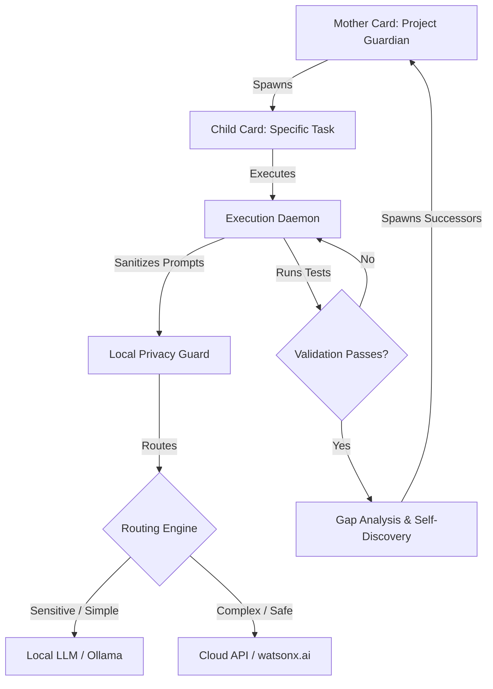

# 👩‍👦 Autonomous Job-Card Engine (AJE)

[](https://opensource.org/licenses/Apache-2.0)
[](https://www.python.org/)
[](#)

> **Say goodbye to active chat prompting.** Define goals declaratively, let the Mother-Child engine orchestrate execution safely, and watch your codebase autonomously self-improve and expand.

---

## 💡 The Core Vision
Most AI agents require continuous user prompting, manual error copying, and direct supervision. The **Autonomous Job-Card Engine (AJE)** introduces a declarative, stateful approach:

1. **Declarative Contracts**: You define a **Mother Card** (rules, design guidelines, security bounds) and initial **Child Cards** (tactical tasks).
2. **Self-Healing Run Loop**: The engine runs code edits, analyzes outputs, executes tests, and iterates until the success criteria defined in the Job Card is met.
3. **Keep Searching & Expanding (Autonomous R&D)**: Once a task completes, the engine scans the codebase, performs semantic gap analysis, designs logical extensions, and generates new child job cards automatically.

---

## 🏗️ Architecture & Flow



---

## 🛡️ Enterprise Security & Hybrid Privacy
*   **Context Sanitization**: Automatically scrubs API secrets, AWS tokens, and certificates before sending any data to cloud models.
*   **Localized Routing Bounds**: Tag sensitive files or paths as private; the engine automatically executes those jobs locally on your workstation using `Qwen2.5-Coder` via Ollama.
*   **Cryptographic Audit Trail**: Every file edit, token execution, and test command is recorded in a local JSON log for historical analysis and security review.

---

## 🚀 Getting Started

### 1. Installation
```bash
git clone https://github.com/your-username/autonomous-job-card-engine.git
cd autonomous-job-card-engine
pip install -r requirements.txt
```

### 2. Define your Mother Card
Create `.jobs/mother_card.yaml`:
```yaml
apiVersion: agent.autonomous.io/v1alpha1
kind: MotherCard
metadata:
  id: "mother-auth-system"
spec:
  core_philosophy: "Always write robust type hints. Maintain 90%+ code coverage."
  safety_policies:
    privacy_mode: "hybrid"
    restricted_paths: ["**/database/config.py"]
```

### 3. Start the Daemon
```bash
python -m src.daemon --watch-dir .jobs/
```
The daemon will boot, index your repository, analyze your `mother_card.yaml`, and begin executing tasks in the background!

---

## 📜 License
Licensed under the Apache License, Version 2.0. See [LICENSE](LICENSE) for details.
