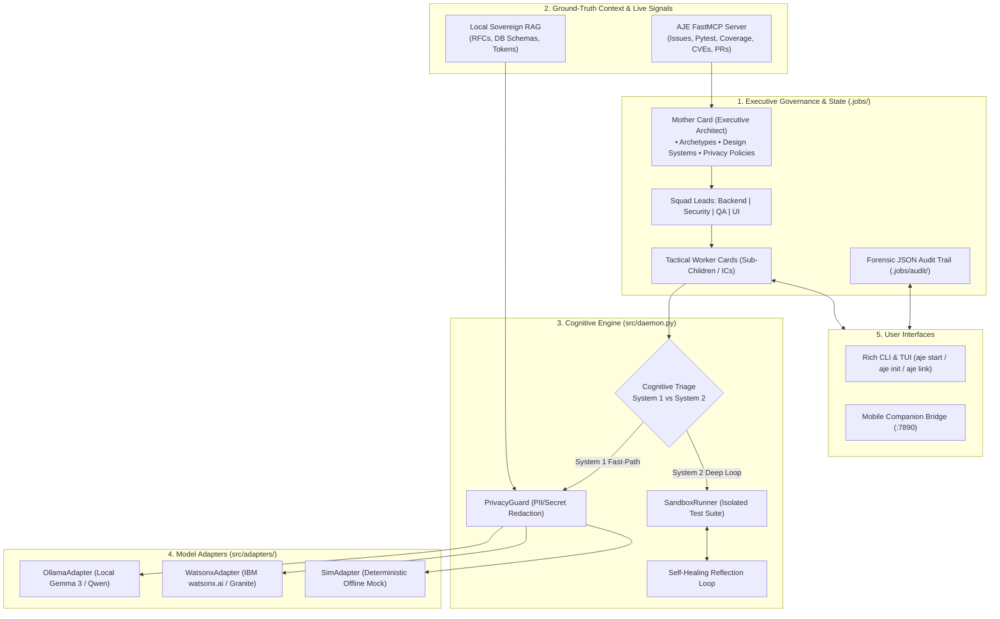
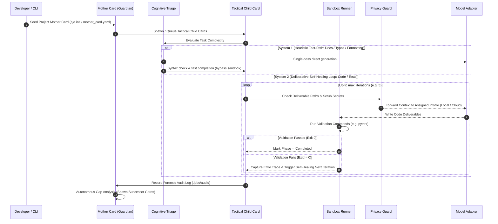

# Software Design Document: Autonomous Job-Card Engine (AJE) v4.0

## 1. Executive Summary
The **Autonomous Job-Card Engine (AJE) v4.0** represents a paradigm shift in autonomous AI engineering. Moving away from synchronous, imperative, chat-based model interactions, AJE introduces a declarative, asynchronous, stateful operating system for entire software engineering fleets.

Key v4.0 capabilities include:
- **Context Window Optimization & AST Skeletonizer**: Reduces token overhead by up to **92%** via AST signature extraction and fault-localized stack trace pruning.
- **Continuous Multi-Tier Alignment Engine**: Automated symbol blast-radius detection cascading QA, documentation, and RAG re-indexing tasks with cryptographic deduplication.
- **Fast Sequential Wave Execution (Tiered DAG Stages)**: Isolated Git worktrees per squad with bounded concurrency ($N=2$) and Hardware/VRAM Sentinel monitors.
- **Zero-Risk Hardened Mitigations**: Dual-pass test flakiness detection, composite integration sandbox gates, and Windows/POSIX path separator normalization.

By employing a **3-Tier Organizational Hierarchy (Mother Card -> Squad Leads -> Tactical Worker Cards)** coupled with a **Dual-Process Cognitive Triage (System 1 vs System 2)**, the system ensures that AI-driven development is strictly governed, secure, private, sovereign, and continuously self-improving.

---

## 2. System Architecture

The system operates across five core architectural layers running locally on the developer's workstation or within a private development VPC:

1. **Executive Governance & State Store (`.jobs/`)**: Maintains immutable YAML state for the Mother Card, Squad Leads, Tactical Child Cards, and forensic JSON audit logs (`.jobs/audit/`).
2. **Ground-Truth Context & Live Signals**:
   * **Local Sovereign RAG**: Offline document chunking and vector retrieval (`.jobs/rag/`) over internal RFCs, architecture guidelines, database schemas, and design system tokens.
   * **FastMCP Server (`mcp-server/`)**: Real-time signal provider feeding open GitHub issues, test failures, coverage reports, outdated dependencies, and `pip-audit` CVEs.
3. **Cognitive Engine Core (`src/daemon.py`)**:
   * **Cognitive Triage**: Dynamically routes low-complexity/doc tasks to **System 1 (Heuristic Fast-Path)** and complex coding/refactoring tasks to **System 2 (Deliberative Sandbox Validation Loop)**.
   * **Privacy Guard (`src/privacy_guard.py`)**: AST & regex scrubbing with sovereign local model fallback based on sensitive path rules.
   * **Sandbox Runner (`src/sandbox.py`)**: Isolated subprocess validation environment enforcing banned-command protection and timeout controls.
4. **Hybrid Sovereign Model Adapters (`src/adapters/`)**:
   * **`OllamaAdapter`**: Local air-gapped LLMs (e.g., Gemma 3, Qwen 2.5 Coder).
   * **`WatsonxAdapter`**: Cloud enterprise models (e.g., IBM watsonx.ai Granite 34B Code Instruct).
   * **`SimAdapter`**: Deterministic offline simulation adapter for end-to-end regression testing.
5. **Control Interfaces**:
   * **Rich CLI (`src/cli/main.py`)**: Interactive wizard (`init`), status monitor (`status`), card injector (`inject`), loop bootstrapper (`start`), and repository binder (`link`).
   * **Mobile Companion Bridge (`src/mobile_bridge.py`)**: Lightweight HTTP/JSON sync on port 7890 for real-time mobile notifications, audit queries, and card approvals/injections.

### 2.1 System Component Diagram



---

## 3. The 3-Tier Mother-Squad-Worker Topology

Governance and task execution are decoupled into three distinct tiers:

* **Level 1: Mother Card (`MotherCard`)**:
  * Defines global mission, design system adherence (e.g. IBM Carbon, Google Material 3), and safety policies.
  * Configures repository bindings (`remote_slug`, `target_branch`, `branch_prefix`).
  * Orchestrates continuous semantic gap analysis and discovers successor cards.
* **Level 2: Squad Lead Cards (`SquadLeadCard`)**:
  * Manages domain-focused tactical departments (`backend`, `security`, `qa`, `ui`, `devops`).
  * Coordinates worker assignment and department-specific quality metrics.
* **Level 3: Tactical Worker Cards (`ChildCard`)**:
  * Scoped IC task executor with explicit deliverables and validation test commands.
  * Bounded by `max_iterations` with self-healing error reflection.

### 3.1 Cognitive Execution & Self-Healing Sequence



---

## 4. Schemas & Data Contracts

### 4.1 Mother Card Schema (`mother_card.yaml`)
```yaml
apiVersion: agent.autonomous.io/v1alpha1
kind: MotherCard
metadata:
  id: "mother-saas-backend"
  name: "SaaS Backend & API Modernizer Mother Card"
spec:
  archetype: "saas-backend"
  core_philosophy: |
    Production-grade SaaS backend service. Every endpoint must be fully typed,
    backed by automated unit tests with >85% coverage, and comply with OpenAPI 3.1.
  design_system: "IBM Carbon Design System"
  safety_policies:
    privacy_mode: "hybrid" # local | cloud | hybrid
    restricted_paths:
      - "**/.env*"
      - "**/database/credentials/*"
      - "**/secrets/**"
    banned_commands:
      - "rm -rf"
      - "docker system prune"
      - "git push --force"
  repository:
    local_path: "."
    remote_slug: "my-org/saas-backend"
    target_branch: "main"
    branch_prefix: "aje/"
    auth_token_env: "GITHUB_TOKEN"
    auto_create_pr: true
    auto_merge_pr: false
  rag_knowledge_paths:
    - "docs"
    - "rfc"
    - "schemas"
  squad_leads:
    - "backend"
    - "security"
    - "qa"
    - "devops"
  global_context:
    target_framework: "FastAPI"
    testing_framework: "pytest"
    db_orm: "SQLAlchemy"
status:
  family_health: "Healthy"
  total_spend_usd: 0.0
  active_children: []
  completed_children: []
  backlog_queue: []
```

### 4.2 Squad Lead Card Schema (`squad_*.yaml`)
```yaml
apiVersion: agent.autonomous.io/v1alpha1
kind: SquadLeadCard
metadata:
  id: "squad-backend"
  parent_mother_id: "mother-saas-backend"
  name: "Backend Squad Lead"
spec:
  domain: "backend"
  domain_mission: "Maintain high-throughput API services and robust data layers."
status:
  assigned_workers:
    - "child-003-jwt-auth"
  completed_workers: []
```

### 4.3 Child Worker Card Schema (`child_*.yaml`)
```yaml
apiVersion: agent.autonomous.io/v1alpha1
kind: ChildCard
metadata:
  id: "child-003-jwt-auth"
  parent_mother_id: "mother-saas-backend"
  name: "JWT Authentication System"
spec:
  parent_squad_id: "squad-backend"
  tactical_objective: "Create app/auth.py with verify_token and hash_password, and a test suite."
  deliverables:
    - path: "app/auth.py"
      description: "Authentication module"
    - path: "tests/test_auth.py"
      description: "Pytest unit tests"
  max_iterations: 5
  rag_query: "Enterprise Authentication Standard RFC hashlib and PyJWT"
  external_ticket_id: "GH-#14"     # Optional: GitHub Issue (GH-#14), ServiceNow (INC0948201), Salesforce, Jira
  source_platform: "GitHub"        # Optional: Source platform (GitHub, ServiceNow, Salesforce, Jira, Pega)
  validation:
    test_commands:
      - "python tests/test_auth.py"
status:
  phase: "Pending" # Pending | Running | Validating | Completed | Failed
  current_iteration: 0
  execution_profile_assigned: "local" # local | cloud
  logs: []
  git_branch: "aje/auth-jwt-impl"
```

---

## 5. Security, Privacy, and Forensic Audit Trail

### 5.1 PrivacyGuard & Dynamic Routing Pipeline
Before any context payload is routed to an LLM provider:
1. **Target File Path Inspection**: If any deliverable or context path matches patterns in `restricted_paths` (e.g. `**/.env*`, `**/secrets*`), the routing profile is automatically set to `local` (bypassing cloud endpoints).
2. **PII and Secret Redaction**: Outbound prompts pass through regex filters and AST scrubbers to mask credentials, private keys, and API tokens.
3. **Model Dispatch**: Requests are sent to `OllamaAdapter` when evaluated as `local`, or to `WatsonxAdapter` when evaluated as `cloud` under hybrid governance.

### 5.2 Forensic JSON Audit Trail
Every action taken across the engine cycle is written to an immutable JSON audit log at `.jobs/audit/audit_<child_id>.json`:

```json
[
  {
    "timestamp": "2026-10-07T20:00:23.960646Z",
    "child_id": "child-003-jwt-auth",
    "action": "privacy_evaluation",
    "details": "Assigned routing profile 'cloud' based on target files.",
    "metadata": {
      "deliverables": [
        {"path": "app/auth.py", "description": "Authentication module"},
        {"path": "tests/test_auth.py", "description": "Pytest unit tests"}
      ]
    }
  },
  {
    "timestamp": "2026-10-07T20:00:23.961140Z",
    "child_id": "child-003-jwt-auth",
    "action": "rag_retrieval",
    "details": "Injected architecture & schema context.",
    "metadata": {
      "rag_query": "Enterprise Authentication Standard RFC hashlib and PyJWT"
    }
  },
  {
    "timestamp": "2026-10-07T20:00:24.155380Z",
    "child_id": "child-003-jwt-auth",
    "action": "sandbox_validation",
    "details": "Executed: python tests/test_auth.py",
    "metadata": {}
  },
  {
    "timestamp": "2026-10-07T20:00:24.305572Z",
    "child_id": "child-003-jwt-auth",
    "action": "task_completed",
    "details": "All deliverables passed verification checks. Committing task.",
    "metadata": {}
  }
]
```
