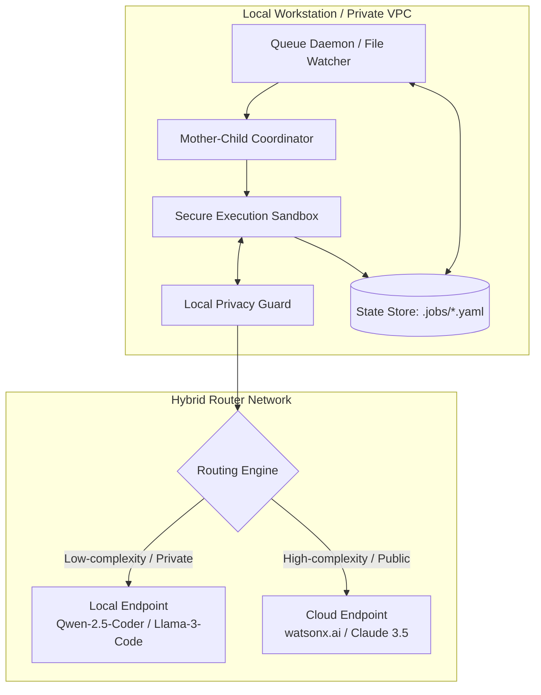
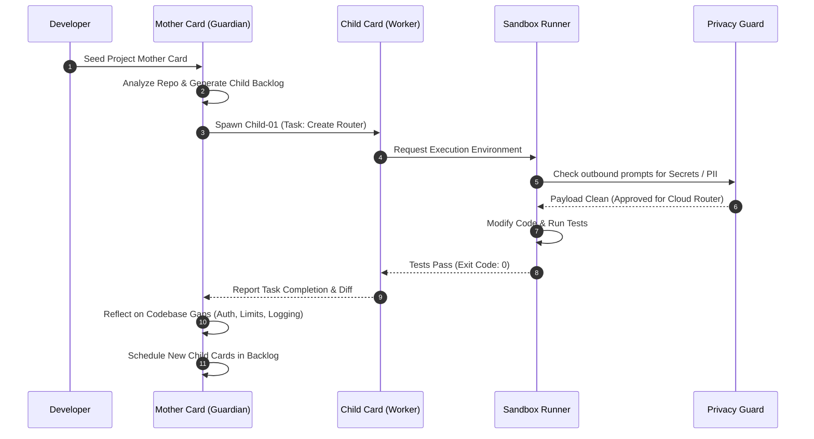

# Software Design Document: Autonomous Job-Card Engine (AJE)

## 1. Executive Summary
The Autonomous Job-Card Engine (AJE) represents a paradigm shift in autonomous AI engineering. Moving away from the highly synchronous, imperative, chat-based model of interaction, the AJE introduces a declarative, asynchronous, stateful system. 

By employing a **Mother-Child topology**, the system ensures that AI-driven development is strictly governed, secure, private, and continuously self-improving. The Mother Card acts as a long-lived, caring guardian defining architectural and safety guardrails, while focused Child Cards execute individual development tasks in a sandboxed loop.

---

## 2. System Architecture

The system is composed of five core architectural layers running locally on the developer's workstation or within a private development VPC:

1. **Queue Daemon (Watcher)**: Monitors a `.jobs/` workspace directory for state changes.
2. **Mother-Child Coordinator**: Maintains parent-child relationships, performs gap-analysis, manages the active backlog, and allocates budget and privacy profiles to children.
3. **Execution Sandbox**: An isolated runner environment (local container or restricted subprocess shell) where code edits are validated using automated test commands.
4. **Local Privacy Guard & Sanitizer**: Filters all context payloads before routing them. It sanitizes PII/secrets and forces local LLM execution if restricted files or logic are detected.
5. **Hybrid Routing Adapter**: Connects to either local endpoints (Ollama, vLLM) or Cloud APIs (watsonx.ai, Anthropic, OpenAI) depending on the task's complexity, cost constraints, and security tier.

### 2.1 System Component Diagram



---

## 3. The Mother-Child Topology

This architecture separates global governance from task execution.

*   **The Mother Card**:
    *   Defines long-term mission objectives.
    *   Enforces global code styling, testing requirements, and directory boundaries.
    *   Acts as a security gateway, auditing and filtering external connections.
    *   Conducts gap-analysis on codebase evolution to schedule next-generation tasks.
*   **The Child Card**:
    *   An ephemeral worker carrying out a singular, tightly-scoped instruction (e.g., "Write tests for endpoint X").
    *   Operates with a maximum iteration count to prevent infinite loops.
    *   Reports results directly back to the Mother.

### 3.1 Execution & Self-Discovery Sequence



---

## 4. Schemas & Data Contracts

### 4.1 Mother Card Schema (`mother_card.yaml`)
```yaml
apiVersion: agent.autonomous.io/v1alpha1
kind: MotherCard
metadata:
  id: "mother-payment-gateway"
  name: "Payment Gateway Master Controller"
spec:
  core_philosophy: |
    Security-first backend architectures. Every public endpoint must 
    have rate limiting and complete validation schemas.
  safety_policies:
    privacy_mode: "hybrid"
    restricted_paths:
      - "**/secrets.env"
      - "**/certs/*"
    banned_commands:
      - "rm -rf"
      - "docker system prune"
    max_budget_usd: 15.00
  global_context:
    target_framework: "FastAPI"
    testing_framework: "pytest"
status:
  family_health: "Healthy"
  total_spend_usd: 2.10
  active_children:
    - id: "child-002-stripe-webhook"
  completed_children:
    - id: "child-001-stripe-scaffolding"
```

### 4.2 Child Card Schema (`child_card.yaml`)
```yaml
apiVersion: agent.autonomous.io/v1alpha1
kind: ChildCard
metadata:
  id: "child-002-stripe-webhook"
  parent_mother_id: "mother-payment-gateway"
  name: "Stripe Webhook Listener"
spec:
  tactical_objective: "Create webhooks listener in app/webhooks.py with event signature verification."
  deliverables:
    - path: "app/webhooks.py"
  validation:
    test_commands:
      - "pytest tests/test_webhooks.py"
status:
  phase: "Running"
  current_iteration: 2
  execution_profile_assigned: "cloud"
```

---

## 5. Security, Privacy, and Audit Logs

### 5.1 Content Sanitization Pipeline
Every payload sent to external endpoints goes through a localized rule engine:
1. **Regex Filter**: Strips patterns matching API Keys, AWS Access Keys, JWT templates, and IP addresses.
2. **Abstract Syntax Tree (AST) Scrubber**: Replaces hardcoded string assignments to credentials variables with safe placeholder flags (e.g., `PASSWORD = "[SCRUBBED_BY_PRIVACY_GUARD]"`).
3. **Data Localization**: If the input context relies on any paths defined in `restricted_paths`, the request is automatically routed to a local **Ollama** or **vLLM** client executing a fine-tuned coding model (e.g., `Qwen2.5-Coder-32B`).

### 5.2 Forensic Audit Trail
Each action executes with a persistent JSON record stored in `.jobs/audit/` to guarantee absolute accountability:

```json
{
  "audit_id": "audit-cf82-108a",
  "timestamp": "2024-11-20T14:55:00Z",
  "child_id": "child-002-stripe-webhook",
  "actions": [
    {
      "type": "privacy_filter",
      "detail": "Replaced hardcoded STRIPE_SECRET_KEY with variable reference before sending context to Cloud API."
    },
    {
      "type": "code_edit",
      "file_path": "app/webhooks.py",
      "lines_added": 45,
      "lines_removed": 0
    },
    {
      "type": "command_execution",
      "command": "pytest tests/test_webhooks.py",
      "exit_code": 0,
      "output": "3 passed, 0 failed"
    }
  ]
}
```
